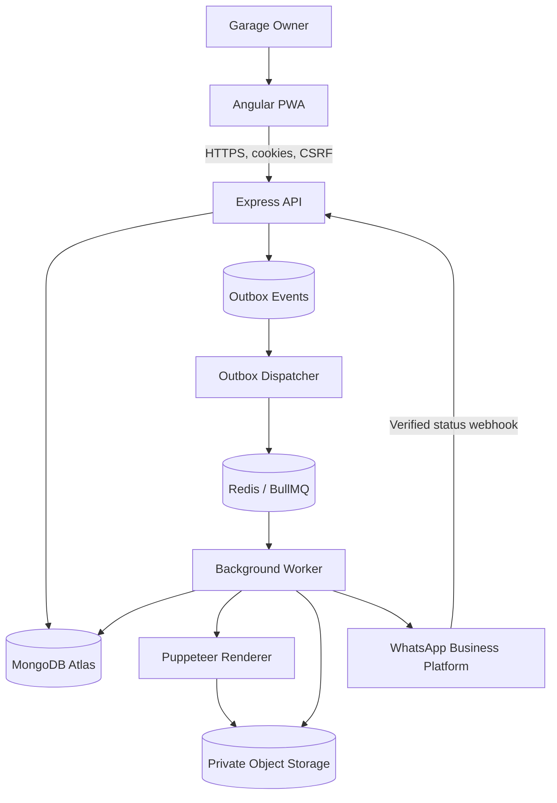

# GarageCare V1 — System Design and Architecture

**Document ID:** GC-SDA-001  
**Version:** 1.0  
**Status:** Implementation baseline  
**Date:** 2026-10-09

## 1. Overview

GarageCare is a responsive Angular PWA backed by a Node.js/Express API, MongoDB Atlas, Redis/BullMQ, private object storage, and the official WhatsApp Business Platform.

The architecture is a **modular monolith with a separately deployed background worker**. The API and worker share domain libraries in an Nx monorepo. Microservices are intentionally out of scope for V1.

## 2. Architecture decisions

| Concern | Decision |
|---|---|
| Monorepo | Nx |
| Frontend | Angular PWA |
| API | Express + TypeScript |
| Database | MongoDB Atlas + Mongoose |
| Authentication | Secure HttpOnly cookies + CSRF |
| Queue | Redis + BullMQ |
| PDF | Puppeteer |
| Object storage | Private S3-compatible bucket |
| WhatsApp | Official WhatsApp Business Platform |
| GST modes | Regular, composition, unregistered |
| API versioning | `/api/v1` |
| Deployment | Separate web, API, and worker processes |

## 3. Context and container diagram



## 4. Nx workspace

```text
apps/
  web/             Angular PWA
  api/             Express REST API
  worker/          BullMQ worker
  api-e2e/         API end-to-end tests
libs/
  shared/contracts/
  shared/validation/
  shared/constants/
  server/auth/
  server/database/
  server/tenancy/
  server/garages/
  server/customers/
  server/vehicles/
  server/parts/
  server/services/
  server/billing/
  server/invoices/
  server/notifications/
  server/reminders/
  server/dashboard/
  server/audit/
  integrations/whatsapp/
  integrations/object-storage/
  integrations/pdf/
  integrations/queue/
  web/feature-*/
  web/ui/
docs/
```

Enforce Nx module boundaries: browser code cannot import server-only libraries or secrets; domain code should not depend directly on Express; integrations should be mockable behind interfaces.

## 5. Backend request pipeline

```text
Request ID
  → security headers
  → cookie parsing
  → authentication
  → CSRF validation for unsafe browser requests
  → garage context
  → request schema validation
  → controller
  → application service
  → domain rules
  → repository
  → MongoDB
  → centralized error handler
```

All authorization decisions occur on the server. Every garage-owned query includes the authenticated `garageId`. Never trust a client-supplied garage ID.

## 6. Domain modules

- **Auth:** Login, logout, password reset, session rotation, CSRF.
- **Garages:** Profile, GST registration mode, invoice settings.
- **Tenancy:** Garage context and resource ownership checks.
- **Customers/Vehicles:** Customer records, vehicle identity, ownership associations.
- **Parts:** Catalog and default pricing.
- **Services:** Job lifecycle, work details, due dates, history.
- **Billing:** Discounts, tax classification, tax calculations, rounding.
- **Invoices:** Number allocation, immutable snapshot, PDF state, corrections.
- **Notifications:** Delivery request lifecycle and provider callback processing.
- **Reminders:** Durable schedules, dispatch, cancellation, reconciliation.
- **Dashboard:** Aggregates for service and invoice activity.
- **Audit:** Security-sensitive and financial events.

Use `presentation`, `application`, `domain`, and `infrastructure` layers within larger modules where it improves clarity.

## 7. Authentication and CSRF

1. Owner submits credentials over HTTPS.
2. API validates the account and password hash.
3. API creates a session and sets Secure, HttpOnly cookies.
4. Angular obtains a session-bound CSRF token.
5. Angular sends the CSRF token in a dedicated header for state-changing requests.
6. API validates session, expiry, revocation, CSRF token, and origin policy.
7. Refresh credentials rotate; logout and security events revoke sessions.

Prefer serving the frontend and API on the same site. `SameSite` cookies are defense in depth and do not replace CSRF validation. Never store refresh tokens in `localStorage`.

## 8. GST-aware billing

Garage configuration supports:
- `regular`
- `composition`
- `unregistered`

The backend selects the appropriate invoice/document format using the validated registration mode, effective date, and applicable transaction tax rules. Regular GST tax invoices, composition-scheme bill-of-supply behavior, and non-GST commercial invoices are distinct. An unregistered garage must not charge or represent an amount as GST collected.

Tax rules must be validated by a qualified Indian GST professional before production. V1 does not file GST returns or guarantee legal compliance.

Money is stored as integer paise where practical. Use decimal arithmetic for intermediate calculations and define deterministic rounding. Preserve the effective tax configuration version in every invoice snapshot.

## 9. Invoice finalization

Perform these writes in one MongoDB transaction where supported:

1. Validate service, customer, vehicle, garage, and lifecycle.
2. Resolve the garage's registration mode and tax configuration.
3. Calculate server-authoritative prices, discounts, and tax.
4. Allocate invoice number atomically.
5. Insert immutable invoice snapshot.
6. Update service state.
7. Insert PDF-generation outbox event.
8. Commit.

PDF generation, object storage, and WhatsApp calls occur after commit. External side effects must never be executed inside a transaction callback that may be retried.

## 10. PDF and WhatsApp flow

1. Worker receives an idempotent PDF-generation job.
2. Worker renders the immutable invoice snapshot using a versioned HTML/CSS template and Puppeteer.
3. Worker stores the PDF in private object storage and records checksum, key, size, and template version.
4. Owner requests delivery.
5. Worker retrieves the PDF, uploads it to WhatsApp as document media, and sends the document message.
6. API records provider message ID and processes verified webhook status events.

Keep invoice status, PDF status, and message status separate. A provider's acceptance response does not equal delivery confirmation. Ambiguous network timeouts require conservative retry/reconciliation to avoid duplicate messages.

## 11. Transactional outbox and worker recovery

The invoice transaction inserts an outbox event. A dispatcher publishes pending events to BullMQ. Because dispatch may happen more than once, consumers are idempotent.

Persist business state in MongoDB. Redis/BullMQ is an execution mechanism, not the sole source of truth. Periodically reconcile pending outbox events and overdue reminders. Recover abandoned processing records using leases or claim timestamps.

Job types:
- `invoice.generate-pdf`
- `invoice.send-whatsapp`
- `reminder.send-whatsapp`
- `reminder.reconcile`
- `notification.reconcile`
- `outbox.dispatch`

Use bounded exponential backoff with jitter. Permanent failures should not retry forever.

## 12. Reminder workflow

Default reminder timing is seven days before a vehicle's next service due date. Persist reminder records in MongoDB and use a deterministic idempotency key such as `garageId:vehicleId:dueDate:upcoming_service`.

Before sending, recheck reminder status, due date, customer contact, consent/opt-out, and messaging eligibility. When due dates change, cancel or supersede old pending reminders. Reconciliation republishes overdue pending work after outages.

## 13. API surface

Base: `/api/v1`

- Auth: `/auth/register`, `/auth/login`, `/auth/refresh`, `/auth/logout`, `/auth/me`, `/auth/csrf`
- Garage: `/garage`
- Customers: `/customers`, `/customers/:id`
- Vehicles: `/vehicles`, `/vehicles/:id`
- Parts: `/parts`, `/parts/:id`
- Services: `/services`, `/services/:id`, `/services/:id/complete`, `/services/:id/history`
- Invoices: `/invoices`, `/invoices/:id`, `/invoices/:id/pdf`, `/invoices/:id/whatsapp`
- Notifications: `/notifications/:id`
- Reminders: `/reminders`, `/reminders/:id`
- Dashboard: `/dashboard/summary`
- WhatsApp webhook: `/webhooks/whatsapp`

Full request/response contracts are defined in `API_SPECIFICATION.md`.

## 14. Security

- TLS and secure cookie configuration.
- Password hashing using Argon2id or properly configured bcrypt.
- CSRF and origin checks.
- Strict CORS policy.
- Rate limiting on authentication and sensitive endpoints.
- Garage-scoped access to every record and file.
- Private object storage with least-privilege IAM.
- Webhook signature validation and deduplication.
- Input validation and output sanitization for PDF rendering.
- Managed secrets, rotation, structured logs, and audit trail.
- No credentials or raw authentication headers in logs.

## 15. Deployment

Deploy independently:
- Angular static assets via CDN/static hosting.
- Express API runtime.
- Worker runtime.
- MongoDB Atlas.
- Managed Redis.
- Private object storage.

Maintain development, staging, and production environments. Use managed secrets, health checks, graceful shutdown, worker concurrency limits, explicit migration/index deployment, backup monitoring, and restore drills.

## 16. Observability

Track:
- API error rate and latency.
- Database connectivity.
- Outbox pending count and age.
- Queue depth, oldest job age, retries.
- PDF generation duration and failure rate.
- WhatsApp submission/delivery outcomes.
- Overdue reminders.
- Storage errors.
- Backup and restore status.

Initial performance target: p95 below 500 ms for ordinary database-backed API requests under expected MVP load, excluding PDF rendering and external messaging. Validate by load testing.

## 17. Testing

- Unit tests for domain rules, billing, rounding, status transitions.
- Integration tests for MongoDB repositories, indexes, and transactions.
- Cross-garage authorization and CSRF tests.
- PDF rendering tests using representative snapshots.
- Mocked WhatsApp API and webhook tests.
- Worker duplicate-job, timeout, retry, and crash-recovery tests.
- Angular component, service, interceptor, and E2E tests.
- Restore and operational recovery drills.

## 18. Architecture acceptance criteria

- API and worker build/deploy independently from the same Nx workspace.
- Tenant isolation applies to all resource and file access.
- Invoice finalization and outbox creation are atomic where supported.
- Invoice snapshots are immutable.
- PDF and messaging failures do not corrupt finalized financial data.
- Reminder schedules and outbox work are recoverable.
- Production security, tax validation, backup, monitoring, and runbooks are complete.
